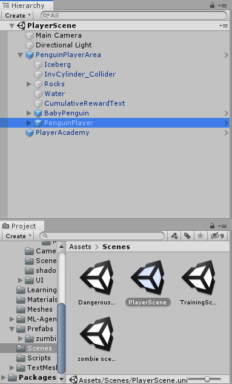
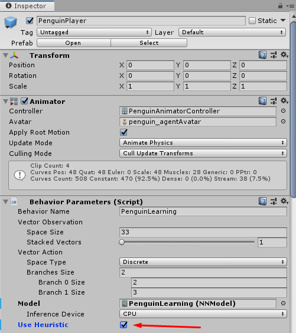

# Introdução
Penguin-AI é uma simulação para treinar um penguim a caçar peixes e alimentar seu filhote. Baseado [neste tutorial](http://www.immersivelimit.com/tutorials/unity-ml-agents-penguins).


# Instalação

Basta seguir o [tutorial do próprio Unity](https://github.com/Unity-Technologies/ml-agents/blob/master/docs/Installation.md).

Também é interessante seguir o tutorial de [como criar um *virtual environment*](https://github.com/Unity-Technologies/ml-agents/blob/master/docs/Using-Virtual-Environment.md)


# Conceitos necessários

Uma contextualização dos três pilares nos quais repousa o Toolkit (Unity ML-Agents) utilizado, e do próprio Toolkit em si.

> Unity ML-Agents (https://github.com/Unity-Technologies/ml-agents/blob/master/docs/ML-Agents-Overview.md)

> Background Unity (https://github.com/Unity-Technologies/ml-agents/blob/master/docs/Background-Unity.md)

> Background Machine Learning (https://github.com/Unity-Technologies/ml-agents/blob/master/docs/Background-Machine-Learning.md)

> Background Tensor Flow (https://github.com/Unity-Technologies/ml-agents/blob/master/docs/Background-TensorFlow.md)


# Conceitos do jogo desenvolvido

O penguim pode, a qualquer momento, tomar alguma entre essas 5 ações:
```
    1 - Movimentação
        i. não se mover
       ii. mover-se pra frente
    2 - Rotação
        i. não rotacionar
       ii. rotacionar pra esquerda
      iii. rotacionar pra direita
```

O penguim consegue perceber/observar, na arena, os elementos:
```
    a) estar alimentado ou não
    b) distância até o filhote
    c) direção até o filhote
    d) direção que o pinguim está olhando
    e) percepção (ângulo e distância incluídas) sobre 3 tipos de objetos:
        i. paredes (wall)
       ii. peixes (fish)
      iii. filhote (baby)
```

O penguim é recompensado se:
```
    a) comer um peixe* (+1)
    b) regurgitar o peixe pro filhote (+2)
    c) comer e regurgitar todos os peixes (+3)

* o penguim não pode comer outros peixes até que regurgite o que acabara de comer
```

O penguim é punido se:
```
    a) colidir com alguma parede (-1/5000)*
    b) a cada tomada de ação (-1/5000)**

 * isto é para desincentivar o penguim à "correr" parado em direção à parede
** isto é para desincentivar o penguim à ficar parado (senão, poderia satisfazer-se com um saldo 0 de recompensas)
```

Cada tentativa é encerrada se:
```
    a) O penguim realizar mais de 5000 ações
    b) Comer e regurgitar todos os peixes
```

# Como explorar o jogo
Para se testar manualmente o jogo, isso é, sem a inteligência do agente em si, basta:
```
1 - abrir a PlayerScene
2 - selecionar o PenguinPlayer
3 - no componente Behavior Parameters, ativar o "Use Heuristic"
```



Passos 1 e 2



Passo 3

# Como treinar o pinguim
Para treinar, basta:
```bash
1 - abrir a TrainingScene
2 - abrir o terminal na pasta "ml-agents-0.11.0"
3 - rodar o comando:
$ mlagents-learn config/trainer_config.yaml --curriculum=config/curricula/penguin/ --run-id={insira nome+id aqui, ex: penguin_10} --train
4 - seguir as orientações da Toolkit
```

# Como reutilizar o cérebro
Para utilizar a inteligência já previamente construída/aprendida, basta:
```
1 - acessar a pasta "ml-agents-0.11.0/models"
2 - escolher alguma das rodadas de treinamentos
3 - importar o arquivo "PenguinLearning.nn" pro unity
4 - no unity, abrir a PlayerScene
5 - selecionar o PenguinPlayer
6 - no componente Behavior Parameters, desativar o "Use Heuristic"
7 - no componente Behavior Parameters, em "Model" selecionar a model importada no passo 3
```

# Visualizando Dados
Para visualizar os dados das models, basta, dentro da pasta ml-agents-0.11.0, rodar:
```bash
$ tensorboard --logdir=summaries
```

E abrir o link gerado no navegador


# Referências

> http://www.immersivelimit.com/tutorials/unity-ml-agents-penguins

> https://github.com/Unity-Technologies/ml-agents/blob/master/docs/Training-PPO.md

> https://github.com/Unity-Technologies/ml-agents/blob/master/docs/Reward-Signals.md

> https://github.com/Unity-Technologies/ml-agents/blob/master/docs/Training-Curriculum-Learning.md

> https://github.com/Unity-Technologies/ml-agents/blob/master/docs/Learning-Environment-Design.md

